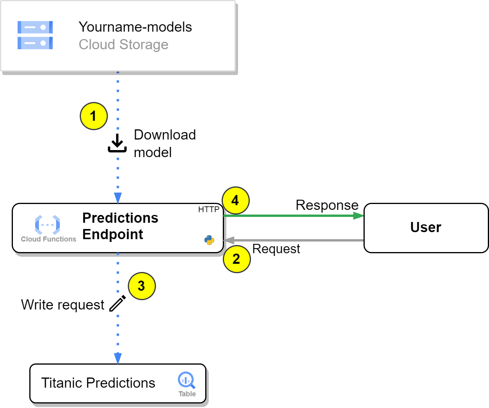

# Create an endpoint to serve the model to the outside world



In this exercise, you'll be working with the `predictions_endpoint` Cloud Function. This HTTP-triggered function serves as the prediction endpoint for clients to send new data points. Upon receiving a request containing new data, the function performs the following steps:

1. It loads the previously trained model from the `[yourname]-models` bucket into memory.
2. Utilizing the loaded model, it generates a prediction based on a data point received in an HTTP request.
3. The function then stores both the prediction and the new data in the `Titanic Prediction` BigQuery table to maintain a record of all predictions.
4. Finally, it returns the prediction result to the client, completing the request-response cycle.

Your task is to create the resources necessary and deploy the function.

The outline of the *Cloud Function* code is available at `./functions/simple_mlops/d_predictions_endpoint/`

## Tasks

- [ ] Create the `Titanic Predictions` Table
  - The table is schena is at `infrastructure/bigquery/titanic_predictions.json`
- [ ] Change the configurations in the `dev.env.yaml` file
- [ ] Change the deployment command to deploy the function correctly.

## Deployment

Deployment:

```bash
FUNCTION_NAME="predictions_endpoint"
YOURNAME="your_name_in_lowercase"

gcloud beta functions deploy $YOURNAME-$FUNCTION_NAME \
    --gen2 --cpu=1 --memory=1024MB \
    --region=europe-west3 \
    --runtime=python311 \
    --source=functions/simple_mlops/d_predictions_endpoint/app/ \
    --env-vars-file=functions/simple_mlops/d_predictions_endpoint/config/dev.env.yaml \
    --allow-unauthenticated \
    --entry-point=?? \
    --trigger-????
```

And then you can test it on [on Stackblitz](https://stackblitz.com/edit/closer-gcp-titanic-frontend-example-v2?file=src%2Fapp%2Ftitanic-prediction.service.ts) and change the `TitanicEndpoint` variable in `./src/app/titanic-prediction.service.ts`.

## Documentation

Does not work without the code correct.